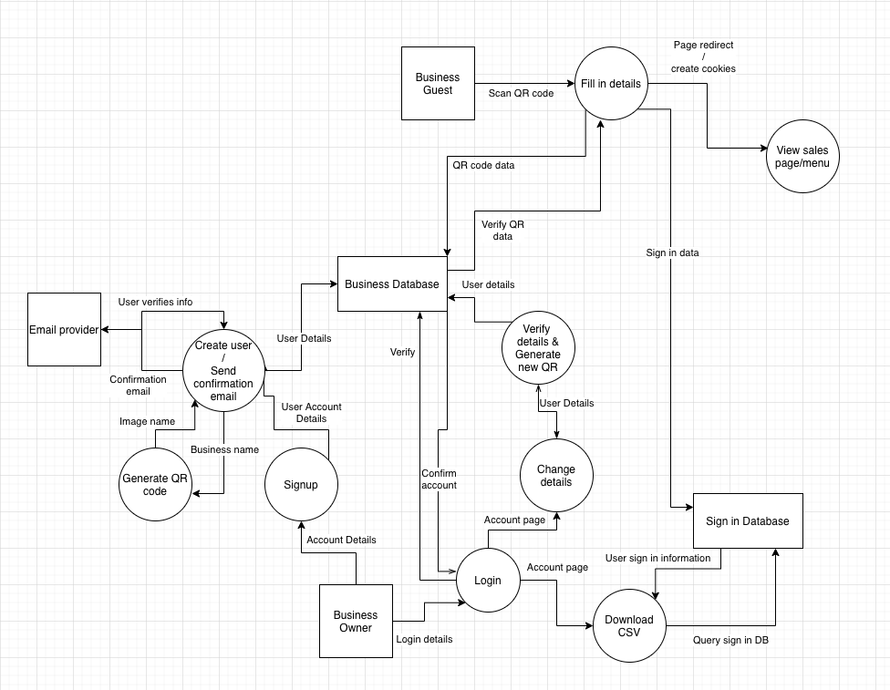
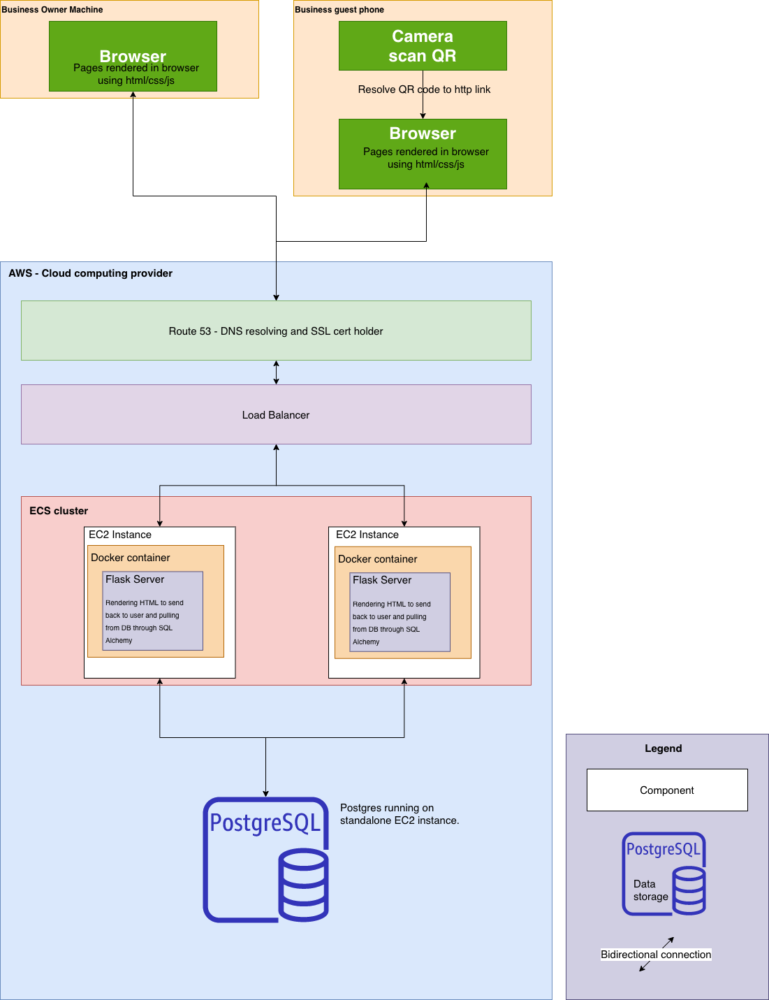
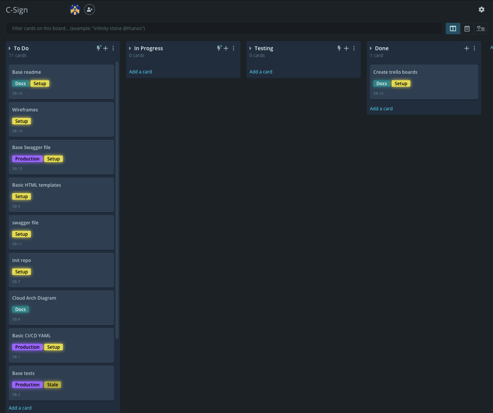
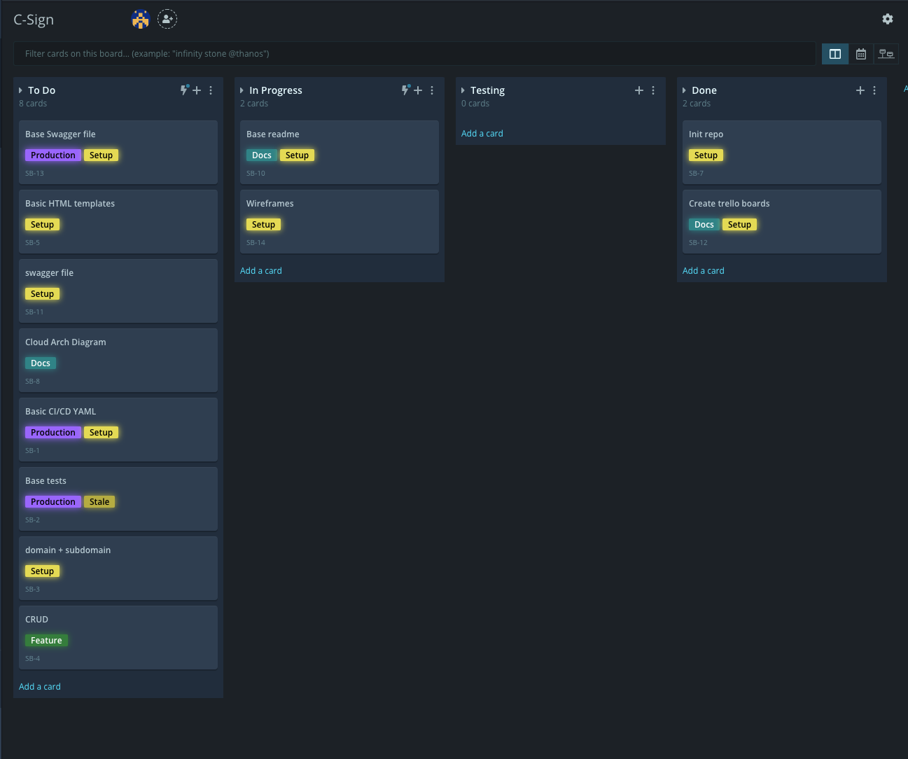
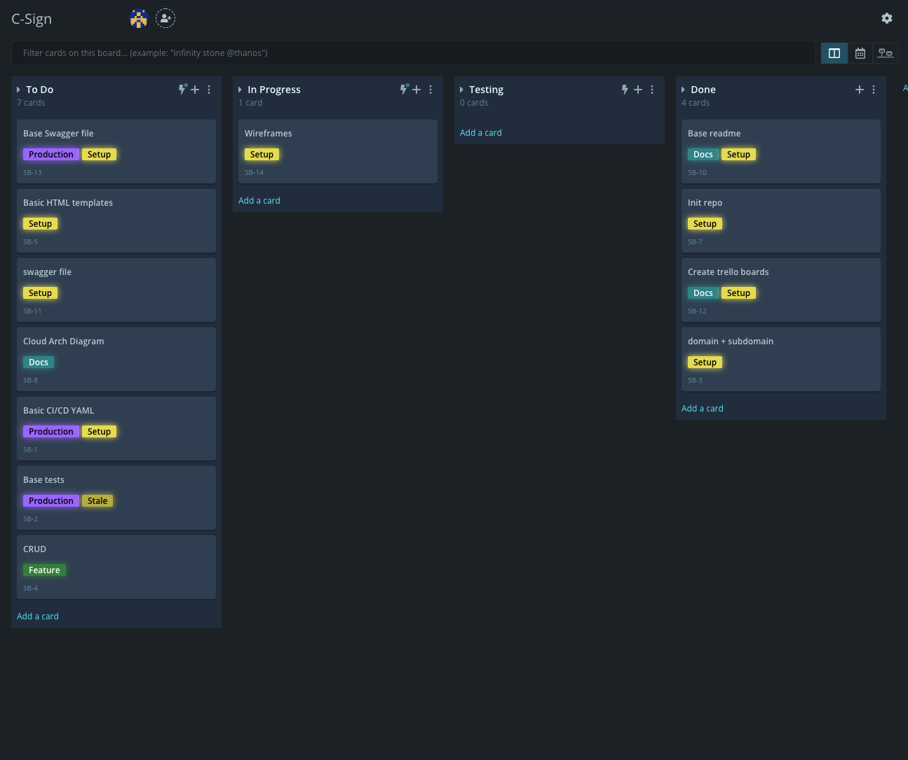
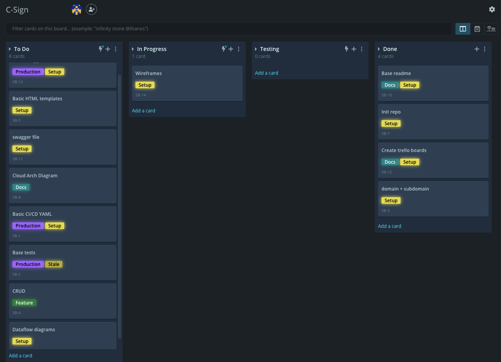
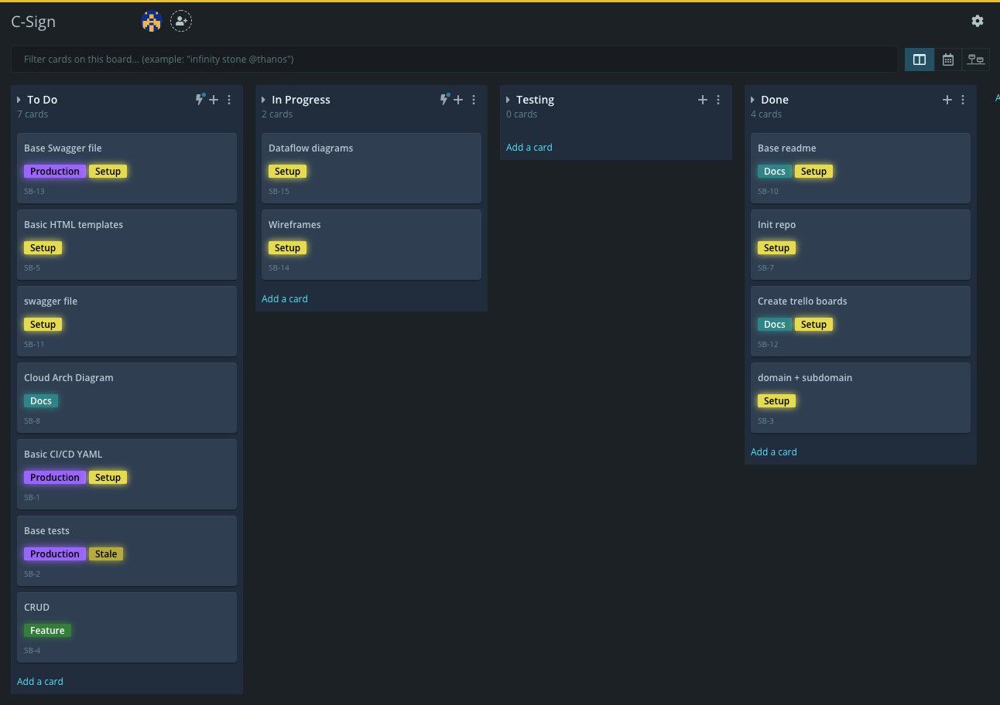
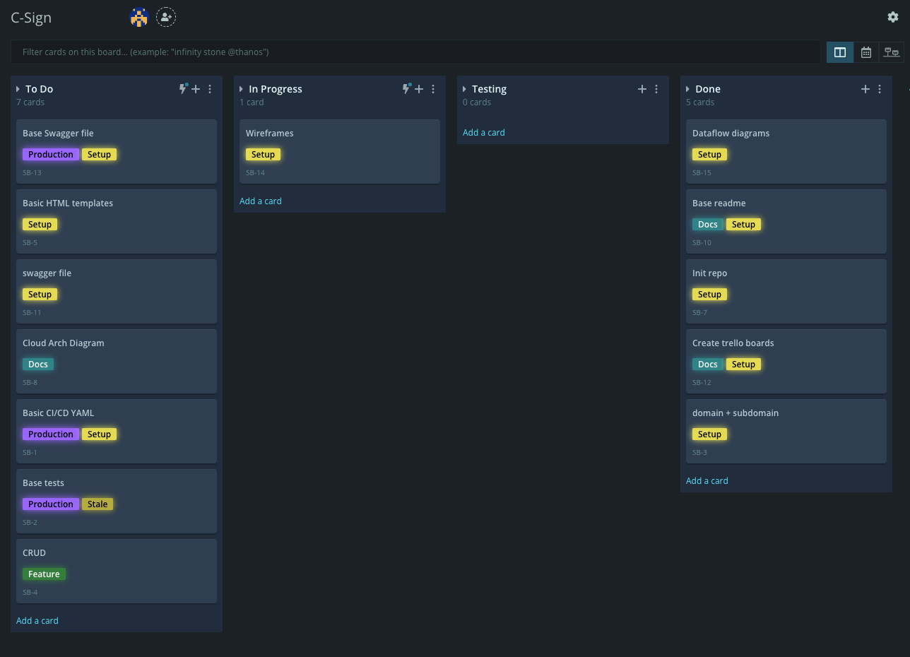

# T4A2-A - Full Stack Application - Part A

## R1 - Description of your website, including:

- __Purpose:__
    C-Sign is built to help businesses in Australia collect data on the times people have visited their venue as required by law. We provide an easy to use system that remembers users preferences and information to make return visits seamless. 
    On top of these features for users the business owner will be able to redirect them to a sales page or menu after sign in so use of multiple QR codes is not needed.

### Functionality / features:
 - __User Features:__
    - Remembering user information by storing and recalling secure cookies.
    - One QR code for menu and sign in. Once a user has signed in they are only required to sign in every 4 hours and only one QR code is needed to get to sales pages or menus.

- __Business Features:__
    - Auto generated QR codes, no need to have your own made to point to the sign up site.
    - Unique web address associated with your business.
    - Easy data collection, owners can download their data anytime via CSV file to upload to their mailing list
    - Integration with Mailchimp API's so that as soon as a guest or customer opts in to your list it will automatically be added. API keys are also encrypted on the back end.

- __Target audience:__
    Target audience for this would be small business owners and hospitality/retail business owners up to large sizes where you want to or need to show someone another page after they sign in for ordering or purchasing. 
    Our aim with C-Sign is offer a premium sign in product for free as a gateway marketing too to sell a suite of hospitality business management apps down the road. Once users have one account a with us it will allow them to easily add on future products with ease.

- __Tech stack:__
    - Python/Flask:
    Python is the programming language of choice and Flask is the back end framework we are using to process and serve webpages to the end user.

    - PostgreSQL:
    Postgres is the relational database for the back end as it integrates with Flask extremely easy and is capable of scaling with ease.

    - Bootstrap:
    Bootstrap is the front end template used for for building the front end.

    - AWS:
    It will be deployed on AWS utilising ECS and ECR for scaling and continuous integration.

## R2 - Dataflow Diagram.

Above we see how the business user can sign up and interact with the backend features as well as guest entering venue can interact with the QR code features to sign in and see the menu.

## R3 - Application Architecture Diagram.

## R4 - User Stories.
#### __Business owner perspectives:__
__Name:__ Michael C

__Persona:__ Small bar owner and award winning bartender

__Demographic:__ Male, 32yo, Inner West

__Usage__: As a bar owner I want to be able to show a menu to the guest after sign in so I don't have to manage multiple QR codes or ask guests to use multiple QR codes. We are a high end cocktail bar and want our experience to be seamless.

__Name:__ Lil E

__Persona:__ Small hand made food retailer

__Demographic:__ Female, 22yo, South West Sydney

__Usage:__ As a small retailer I would like to be able to redirect my customers to a specials page after they sign in to highlight our current offers. My offers keep changing and it costs money to keep reprinting everything especially in a pandemic when you know business is down. I need to be able to send my customers to the latest sales as soon as they sign in.

__Name:__ Jean-Baptiste

__Persona:__ Large restaurant owner

__Demographic:__ Male 55yo, North Sydney

__Usage:__ As a restaurant owner I want to be able to show a user our upcoming lunch opening hours after they sign in so they can be more informed. The age group for my restaurant is higher and tend not to use things like instagram or facebook where we market most of out specials. I want to be able to show them as soon as they have signed in.

#### __Guest/Customer perspectives:__

__Name:__ Gabrielle P

__Persona:__ Startup founder

__Demographic:__ Male, 48yo, Beaches

__Usage:__ As a regular a X bar I don't want to scan multiple QR codes multiple times in a seating, it takes away from the experience. I visit this bar everyday and have many meetings here, first thing I want is when I have someone come to meet is to be able to get in easy and not have to break conversation by scanning multiple QR codes trying to figure out how to sign in. It would look bad on me as business person for picking the wrong place.

__Name:__ Kate P

__Persona:__ Foody and amateur reviewer

__Demographic:__ Female, 42yo, Office worker, Inner Sydney

__Usage:__ As a guest at X bar I want to be able to sign up to their mailing list with ease and get their menu straight away by scanning the QR code once and if I scan again I don't want to have to sign in again. I want to get to the menu straight away and be able to see what I am having on the night.

__Name:__ Carli C

__Persona:__ High school teacher

__Demographic:__ Female, 31yo, South West Sydney

__Usage:__ As a shopper at X retail store I want to be able to view specials on my phone after I sign in as I shop so I know where the deals are. I hate messing around and having to put in my details all the time, I wish there was one that remembered me.

## R5 - Wireframes for multiple standard screen sizes, created using industry standard software.
### __Mobile Wireframes:__
__Mobile Login__

__Mobile Account Signup__

__Mobile Account Settings__

__Mobile Guest Sign In__
Once the QR code is scanned for the particular business it will resolve and take the user here to sign in. Once signed in it will goto the business owners page or if one is not set a thank you page.

### __Desktop Wireframes:__
__Desktop Homepage__

__Desktop Login__

__Desktop Account Signup__

__Desktop Account Page__

## R6 - Screenshots of your Trello board throughout the duration of the project.

I have chosen the kanban style workflow on top of github boards which can easily be setup to mimic trello boards. it just allows
 you to use them attached to the repo you are working with.

